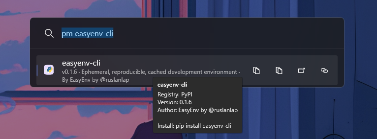
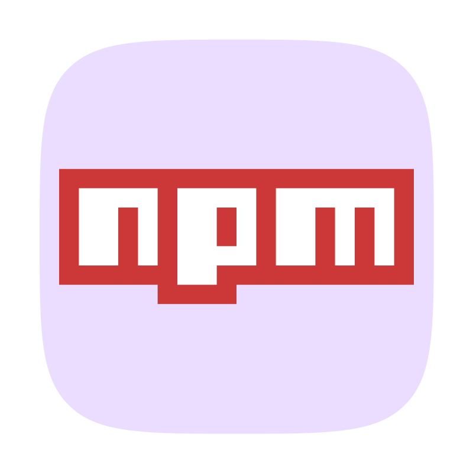
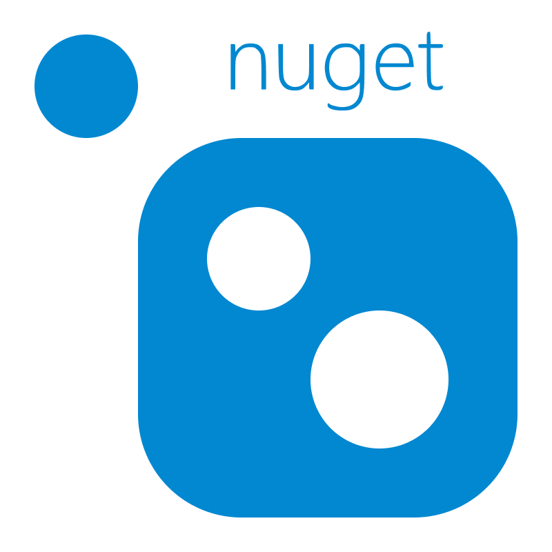
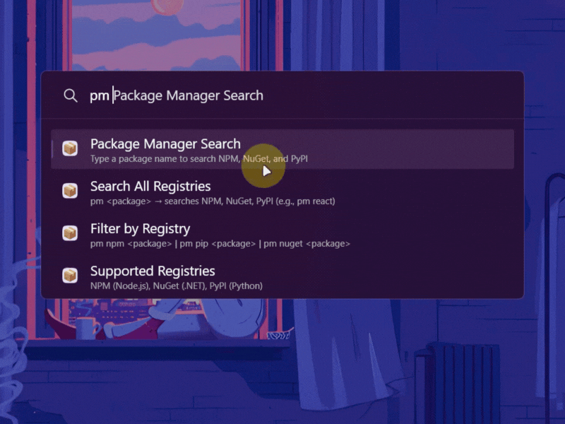
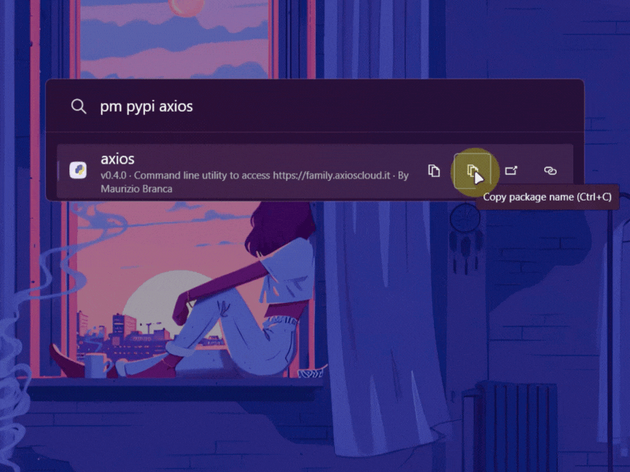

<div align="center">

# 📦 Package Manager for PowerToys Run


### ⚡ Search NPM, NuGet & PyPI Instantly ⚡

**Stop switching to your browser to find packages.**  
Search across NPM, NuGet, and PyPI with `Alt+Space` → `pm react` → Done! ✨

<!-- Badges -->

[](https://github.com/ruslanlap/PowerToysRun-PackageManager/actions)
[](https://github.com/ruslanlap/PowerToysRun-PackageManager/releases/latest)


[](https://github.com/ruslanlap/PowerToysRun-PackageManager/stargazers)
[](https://github.com/ruslanlap/PowerToysRun-PackageManager/issues)
[](https://github.com/ruslanlap/PowerToysRun-PackageManager/releases/latest)


[](https://opensource.org/licenses/MIT)

</div>

<div align="center">
  <a href="https://github.com/ruslanlap/PowerToysRun-PackageManager/releases/download/v1.0.0/PackageManager-1.0.0-x64.zip">
    
  </a>
  <a href="https://github.com/ruslanlap/PowerToysRun-PackageManager/releases/download/v1.0.0/PackageManager-1.0.0-ARM64.zip">
    
  </a>
</div>

---
<div align="center">
  
</div>
<div align="center">

### ⚠️ **Important Note for Better Performance**

**To improve response speed and result accuracy**, please try to specify the package manager name in your search query:

- `pm npm <package>` - Search only NPM (faster, more accurate)
- `pm nuget <package>` - Search only NuGet (faster, more accurate)
- `pm pip <package>` - Search only PyPI (faster, more accurate)

This simplifies the work for both you and the plugin by searching only the relevant registry instead of all three simultaneously.

</div>

---

### 1️⃣ **Download & Extract** (30 seconds)

**Option A: Download from Releases**

1. Go to [Releases](https://github.com/ruslanlap/PowerToysRun-PackageManager/releases/latest)
2. Download `PackageManager-1.0.0-x64.zip` or `PackageManager-1.0.0-ARM64.zip`
3. Extract the ZIP file

### 2️⃣ **Install to PowerToys** (30 seconds)

**Installation Steps:**

1. Press `Win + R` to open the Run dialog
2. Paste the following path and press Enter:
    ```
    %LOCALAPPDATA%\Microsoft\PowerToys\PowerToys Run\Plugins\
    ```
3. Copy the extracted `PackageManager` folder into the `Plugins` directory
4. Your folder structure should look like this:
    ```
    Plugins\
      └── PackageManager\
          ├── Community.PowerToys.Run.Plugin.PackageManager.dll
          ├── plugin.json
          └── Images\
              ├── packagemanager.dark.png
              └── packagemanager.light.png
    ```

### 3️⃣ **Restart PowerToys** (15 seconds)

1. Right-click the PowerToys icon in your system tray
2. Click "Exit" or "Quit"
3. Launch PowerToys again from the Start menu
4. Press `Alt + Space` to open PowerToys Run
5. Type `pm` to verify the plugin is working

---

## 🎯 Why Developers Love This Plugin

<div align="center">

**"Stop opening npmjs.com, nuget.org, or pypi.org for every package search"**

| ❌ Before                                    | ✅ With Package Manager          |
| -------------------------------------------- | -------------------------------- |
| Open browser → Search package → Copy command | `Alt+Space` → `pm react` → Copy  |
| 20+ seconds, context switching               | **2 seconds, zero interruption** |

</div>

### 🚀 **Quick Demo** - Try it now:

<div align="center">
  
</div>

```
Alt+Space → pm react              # 🔍 Search all registries
Alt+Space → pm npm express        # 📦 Search only NPM
Alt+Space → pm nuget entity       # 🎯 Search only NuGet
Alt+Space → pm pip django         # 🐍 Search only PyPI
```

---

## ⌨️ Keyboard Shortcuts

<div align="center">

| Action                   | Shortcut                            | Description                             |
| ------------------------ | ----------------------------------- | --------------------------------------- |
| **Copy Install Command** | `Enter`                             | Copies `npm install react` to clipboard |
| **Copy Package Name**    | `Ctrl+C`                            | Copies just the package name            |
| **Open Package Page**    | `Ctrl+O`                            | Opens package URL in browser            |
| **Copy Package URL**     | `Ctrl+U`                            | Copies package URL to clipboard         |
| **Context Menu**         | `Right-Click` or `Ctrl+Shift+Enter` | Shows all available actions             |

</div>

---

## 📊 Supported Package Managers

<div align="center">

| Registry                                          | Icon                                         | Packages           | Command Examples                        |
| ------------------------------------------------- | -------------------------------------------- | ------------------ | --------------------------------------- |
|  **NPM**     |    | Node.js/JavaScript | `pm npm react` `pm npm @types/node`     |
|  **NuGet** |  | .NET/C#            | `pm nuget newtonsoft` `pm nuget entity` |
|  **PyPI**   |   | Python             | `pm pip django` `pm pip requests`       |

</div>

---

## ⚡ Features

<div align="center">
<table>
<tr>
<td align="center" width="33%">

<br><b>⚡ Lightning Fast</b><br>
<sub>Parallel API searches with<br>intelligent caching</sub>
</td>
<td align="center" width="33%">

<br><b>🔍 Smart Search</b><br>
<sub>Handles scoped packages,<br>variations, and aliases</sub>
</td>
<td align="center" width="33%">

<br><b>🎨 Theme-Aware</b><br>
<sub>Beautiful icons for<br>dark and light modes</sub>
</td>
</tr>
<tr>
<td align="center" width="33%">

<br><b>📦 Multi-Registry</b><br>
<sub>Search NPM, NuGet, PyPI<br>simultaneously or filtered</sub>
</td>
<td align="center" width="33%">

<br><b>📋 Quick Actions</b><br>
<sub>Copy install commands,<br>URLs, or package names</sub>
</td>
<td align="center" width="33%">

<br><b>🌐 Direct Links</b><br>
<sub>Open package pages<br>with one click</sub>
</td>
</tr>
</table>
</div>

---

## 📸 Gallery

<div align="center">

### Search All Registries



### NPM Package Search


### PyPI Package Search



</div>

---

## 🏃‍♂️ Quick Start

### 1️⃣ **Download & Extract** (30 seconds)

**Download Plugin:**

1. Go to [Releases](https://github.com/ruslanlap/PowerToysRun-PackageManager/releases/latest) page
2. Download `PackageManager-1.0.0-x64.zip` or `PackageManager-1.0.0-ARM64.zip`
3. Extract the ZIP file

### 2️⃣ **Install to PowerToys** (30 seconds)

**Installation Steps:**

1. Press `Win + R` to open the Run dialog
2. Paste the following path and press Enter:
    ```
    %LOCALAPPDATA%\Microsoft\PowerToys\PowerToys Run\Plugins\
    ```
3. Copy the extracted `PackageManager` folder into the `Plugins` directory
4. Your folder structure should look like this:
    ```
    Plugins\
      └── PackageManager\
          ├── Community.PowerToys.Run.Plugin.PackageManager.dll
          ├── plugin.json
          └── Images\
              ├── packagemanager.dark.png
              └── packagemanager.light.png
    ```

### 3️⃣ **Restart PowerToys** (15 seconds)

1. Right-click the PowerToys icon in your system tray
2. Click "Exit" or "Quit"
3. Launch PowerToys again from the Start menu
4. Press `Alt + Space` to open PowerToys Run
5. Type `pm` to verify the plugin is working

---

## 💡 Usage Examples

<div align="center">

### Basic Commands

| Command           | Description                       | Result                                  |
| ----------------- | --------------------------------- | --------------------------------------- |
| `pm react`        | Search all registries for "react" | Shows results from NPM, NuGet, PyPI     |
| `pm npm lodash`   | Search only NPM                   | Shows NPM packages matching "lodash"    |
| `pm nuget entity` | Search only NuGet                 | Shows NuGet packages matching "entity"  |
| `pm pip requests` | Search only PyPI                  | Shows PyPI packages matching "requests" |

</div>

### Advanced Examples

```bash
# Search for scoped packages
pm npm @types/node           # TypeScript types
pm npm @google/gemini        # Google's Gemini SDK

# Search with variations
pm npm express               # Finds express, @types/express, etc.
pm pip django                # Finds django, django-rest-framework, etc.

# Framework-specific searches
pm nuget automapper          # .NET mapping library
pm npm react-router          # React routing library
pm pip flask                 # Python web framework
```

---

## 🔧 Configuration

### Change Trigger Keyword

1. Open PowerToys Settings
2. Go to **PowerToys Run** → **Plugins**
3. Find **Package Manager**
4. Change **Direct activation command** from `pm` to your preference (e.g., `pkg`, `package`)

### Disable Specific Registries

Currently, all three registries (NPM, NuGet, PyPI) are enabled by default. To search only one registry, use the filter syntax:

- `pm npm <query>` - Only NPM
- `pm nuget <query>` - Only NuGet
- `pm pip <query>` - Only PyPI

---

## 🏗️ Technical Details

<details>
<summary><b>📋 Architecture Overview</b></summary>

### Core Components

```
┌─────────────────────────────────────┐
│        PowerToys Run Plugin         │
│              (Main.cs)              │
└─────────────┬───────────────────────┘
              │
              ▼
┌─────────────────────────────────────┐
│      PackageSearchService           │
│   (Orchestrates all searches)       │
└─────────┬───────────────────────────┘
          │
          ├──► NpmRegistryClient ──► NPM API
          │
          ├──► NuGetRegistryClient ──► NuGet API
          │
          └──► PyPIRegistryClient ──► PyPI API
```

### Key Features

- **Parallel Searches**: All registries searched simultaneously for maximum speed
- **Smart Caching**: 10-minute cache with LRU eviction (100 entries max)
- **Query Variations**: Automatically tries package name variations (scoped, CLI suffixes, etc.)
- **Cancellation Support**: Previous searches cancelled when new query starts
- **Theme-Aware Icons**: Automatically switches between dark/light mode icons

</details>

<details>
<summary><b>🧪 Tech Stack</b></summary>

- **Framework**: .NET 9.0 (Windows 10.0.22621.0)
- **Language**: C# 12 with nullable reference types
- **UI**: WPF integration via PowerToys Run API
- **HTTP Client**: System.Net.Http with JSON extensions
- **Dependencies**:
    - `Community.PowerToys.Run.Plugin.Dependencies` (v0.93.0)
    - `System.Net.Http.Json` (v9.0.10)
    - `System.Text.Json` (v9.0.10)

### APIs Used

- **NPM**: `https://registry.npmjs.org/-/v1/search`
- **NuGet**: `https://api-v2v3search-0.nuget.org/query`
- **PyPI**: `https://pypi.org/pypi/{package}/json`

</details>

<details>
<summary><b>🏗️ Project Structure</b></summary>

```
PackageManager/
├── Community.PowerToys.Run.Plugin.PackageManager/
│   ├── Main.cs                          # Plugin entry point
│   ├── plugin.json                      # Plugin metadata
│   ├── Models/
│   │   ├── PackageInfo.cs              # Unified package model
│   │   ├── PackageRegistry.cs          # Registry enum
│   │   ├── QueryParser.cs              # Query parsing logic
│   │   ├── NpmApiModels.cs             # NPM API response models
│   │   ├── NuGetApiModels.cs           # NuGet API response models
│   │   └── PyPIApiModels.cs            # PyPI API response models
│   ├── Services/
│   │   ├── PackageSearchService.cs     # Search orchestrator
│   │   ├── IRegistryClient.cs          # Registry client interface
│   │   ├── NpmRegistryClient.cs        # NPM API client
│   │   ├── NuGetRegistryClient.cs      # NuGet API client
│   │   ├── PyPIRegistryClient.cs       # PyPI API client
│   │   └── CacheService.cs             # Search results cache
│   └── Images/
│       ├── packagemanager.light.png
│       ├── packagemanager.dark.png
│       ├── npm.light.png
│       ├── npm.dark.png
│       ├── nuget.light.png
│       ├── nuget.dark.png
│       ├── pypi.light.png
│       └── pypi.dark.png
└── Community.PowerToys.Run.Plugin.PackageManager.UnitTests/
    └── MainTests.cs                     # Unit tests
```

</details>

---

## 🚀 Building from Source

### Prerequisites

- Windows 10/11
- .NET 9.0 SDK
- PowerToys installed
- Visual Studio 2022 (optional)

### Build Steps

```bash
# Clone the repository
git clone https://github.com/ruslanlap/PowerToysRun-PackageManager.git
cd PowerToysRun-PackageManager/PackageManager

# Build for x64
dotnet build Community.PowerToys.Run.Plugin.PackageManager/Community.PowerToys.Run.Plugin.PackageManager.csproj -c Release -p:Platform=x64

# Build for ARM64
dotnet build Community.PowerToys.Run.Plugin.PackageManager/Community.PowerToys.Run.Plugin.PackageManager.csproj -c Release -p:Platform=ARM64

# Output will be in:
# bin/x64/Release/net9.0-windows10.0.22621.0/
# bin/ARM64/Release/net9.0-windows10.0.22621.0/
```

### Install Locally

```bash
# Windows (PowerShell)
./install-local.bat

# Or manually copy to:
%LOCALAPPDATA%\Microsoft\PowerToys\PowerToys Run\Plugins\PackageManager\
```

---

## 🆘 Troubleshooting

<details>
<summary><b>❌ Plugin doesn't appear in PowerToys Run</b></summary>

1. Verify plugin is in correct location:
    ```
    %LOCALAPPDATA%\Microsoft\PowerToys\PowerToys Run\Plugins\PackageManager\
    ```
2. Check that `plugin.json` and `.dll` files are present
3. Restart PowerToys completely (Exit → Relaunch)
4. Open PowerToys Settings → PowerToys Run → Plugins
5. Enable "Package Manager" if it's disabled

</details>

<details>
<summary><b>🔍 Search returns no results</b></summary>

**Possible causes:**

- Network connectivity issues
- API rate limiting (rare)
- Package doesn't exist in searched registry

**Solutions:**

1. Check your internet connection
2. Try a different package name
3. Use registry filter: `pm npm <package>` instead of `pm <package>`
4. Clear cache by restarting PowerToys

</details>

<details>
<summary><b>🐌 Search is slow</b></summary>

**First search is always slower** (no cache). Subsequent searches are instant.

**If consistently slow:**

1. Check your internet speed
2. Try filtered search (one registry): `pm npm react`
3. Restart PowerToys to clear cache and reinitialize

</details>

<details>
<summary><b>🎨 Icons not showing correctly</b></summary>

1. Verify `Images/` folder exists in plugin directory
2. Check PowerToys theme settings (Light/Dark/Auto)
3. Restart PowerToys to reload icons

</details>

<details>
<summary><b>⚠️ Cached Results - Important Note</b></summary>

**To see updated cached results**, sometimes you need to press **Space** or press **Backspace** to trigger a fresh search and see the updated results.

This happens because the plugin uses intelligent caching (10-minute cache) to speed up searches. If you're seeing stale results, try:

1. Press **Space** or **Backspace** to trigger a fresh search
2. Or press Backspace to delete and retype the last character
3. This will force a new search and refresh the cached results

</details>

---

## ❓ FAQ

<details>
<summary><b>Can I search multiple registries at once?</b></summary>

Yes! Just use `pm <package>` without a registry filter. Example:

```
pm react    # Searches NPM, NuGet, and PyPI simultaneously
```

</details>

<details>
<summary><b>How do I install a package after finding it?</b></summary>

1. Select the package in PowerToys Run
2. Press `Enter` to copy the install command (e.g., `npm install react`)
3. Paste in your terminal and run

</details>

<details>
<summary><b>Does this plugin install packages automatically?</b></summary>

No. This plugin only **searches** and provides **install commands**. You still need to run the command in your terminal. This is intentional for safety and control.

</details>

<details>
<summary><b>Can I use different package manager commands?</b></summary>

The plugin provides standard commands:

- NPM: `npm install <package>`
- NuGet: `dotnet add package <package>`
- PyPI: `pip install <package>`

You can modify these after copying (e.g., change `npm install` to `yarn add`).

</details>

<details>
<summary><b>Why is NPM search showing unexpected results?</b></summary>

NPM has millions of packages with many variations. The plugin:

- Tries multiple search variations (scoped packages, CLI suffixes)
- Ranks results by relevance score
- Shows top 10 results per registry

For better results, be more specific or use exact package names.

</details>

---

## 🔒 Privacy & Security

### Network Requests

This plugin makes HTTP requests to public APIs:

- **NPM**: `registry.npmjs.org`
- **NuGet**: `api-v2v3search-0.nuget.org`
- **PyPI**: `pypi.org`

**No tracking, analytics, or telemetry** is sent to any third parties.

### Data Storage

- **Search cache**: Stored in memory only (cleared on PowerToys restart)
- **No persistent storage**: No files written to disk
- **No personal data**: Only package names are sent to APIs

### API Keys

This plugin does **not require API keys**. All registries provide public search APIs.

---

## 📄 License

This project is licensed under the **MIT License** - see the [LICENSE](LICENSE) file for details.

```
MIT License
Copyright (c) 2025 ruslanlap
```

---

## 🙏 Acknowledgements

<div align="left">

**Built with ❤️ using:**

- [PowerToys](https://github.com/microsoft/PowerToys) by Microsoft
- [Community.PowerToys.Run.Plugin.Templates](https://github.com/hlaueriksson/Community.PowerToys.Run.Plugin.Templates)
- [NPM Registry API](https://github.com/npm/registry)
- [NuGet API](https://docs.microsoft.com/en-us/nuget/api/overview)
- [PyPI JSON API](https://warehouse.pypa.io/api-reference/)

**Special thanks to:**

- PowerToys team for the amazing plugin framework
- Henrik Lau Eriksson for the plugin templates
- All contributors and users of this plugin

</div>

---

<div align="center">

### 🚀 **Ready to supercharge your package search workflow?**

<a href="#-quick-start">
  
</a>

<br><br>

**Found this useful?** Give it a ⭐ on GitHub!

**Have questions?** Open an issue or discussion in your repository

**Ready to release?** Create a tag: `git tag v1.0.0 && git push origin v1.0.0`

---

Made with ❤️ by YOU | Build with PowerToys Run API | MIT License

</div>
